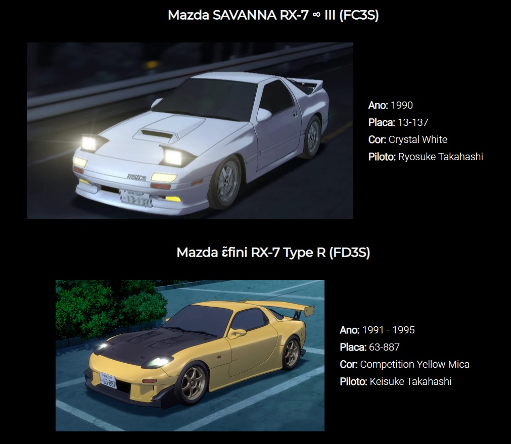

<h1>Website do <b>Project D</b> (Anime Initial D)</h1>

Projeto do site do Project D, do anime Initial D, com HTML e CSS.

A homepage do site aparece no primeiro ato do quarto estágio do anime (Fourth Stage - Act 1).

<ul>
    
</ul>
 
<h1>Páginas</h1>
<ul>
    <li><h2>Home</h2></li>
    
    <li><h2>Galeria</h2></li>
    
    <li><h2>Blog</h2></li>
    
    <li><h2>Contato</h2></li>
    
</ul>
 
<h1>Interações</h1>
<ul>
    <li>
        <h2>Menu (Logo)</h2>
        
Passando o mouse por cima, opção muda de cor.

    </li>
    
    <li>
        <h2>Menu (Home)</h2>
        
Passando o mouse por cima, menu expande.

    </li>
    
    <li>
        <h2>Logo</h2>
        
Passando o mouse por cima, logo expande.

    </li>
    a
    <li>
        <h2>Imagens</h2>
        
Passando o mouse por cima, imagem expande.

    </li>
    
</ul>
 
<h1>Projeto de Faculdade</h1>

Esse projeto foi realizado para a disciplina de Desenvolvimento Front-End na Universidade Católica de Brasília (UCB).
